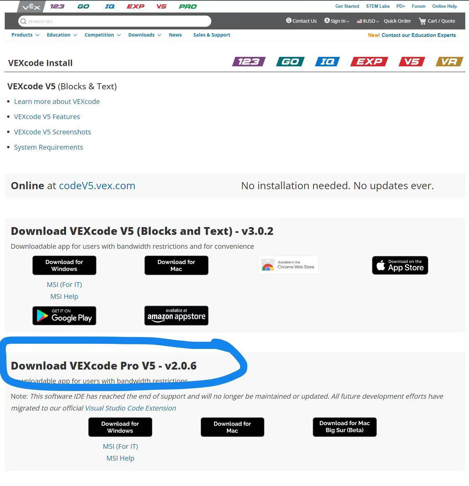
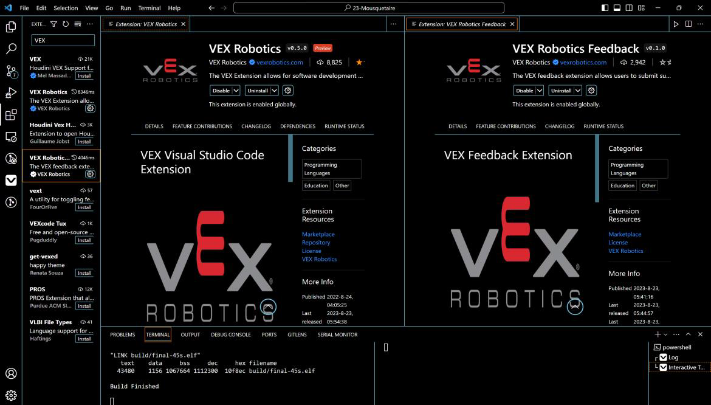

**所有人面试时需要携带电脑  
要求电脑上至少有VEXcode Pro V5, 强烈建议在VSCode中配置VEX插件  
第一二志愿报名程序组者有以自己学号命名的分支, 若有遗漏, 请于11/24前反馈至QQ群**  
# 1. 软件配置
### VEXcode Pro V5, 请参考
https://www.vexrobotics.com/vexcode/install/v5

### VSCode 插件
**方法: 插件(Extension)-> 搜索VEX-> 安装如图两个插件**

# 2. 面试内容
## 1. C++基础使用
## 2. 电控元件以及VEXCode的基础了解
## 3. GitHub的使用, 建议提前配置GitHub, 学习基础Git指令
**不做强制要求, 但成功推送至个人分支有附加分**
**目前所有第一二志愿报名程序组的同学都有以自己学号命名的分支**
克隆仓库: `git clone  
git@github.com:Songjiaxin11/Interview.git`  
切换分支: `git checkout branch-name` **一定要切换至个人分支**  
拉取分支: `git pull`  
添加修改: `git add .`  
提交修改: `git commit -m "message"`  
推送至分支: `git push`  

